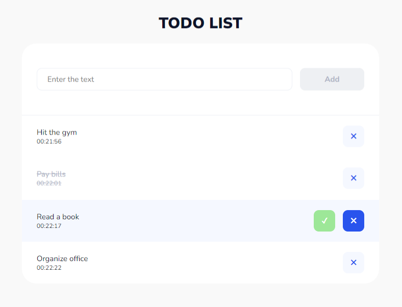

# Redux Core todo list - Vanilla JS

## Live: https://redux-core-todo.vercel.app/

## Actions:
- **activeFormBtn** - action to change the form button;
- **addTodo** - action to add an item to the list;
- **toggleTodo** - action to change the status of an element;
- **removeTodo** - action to remove an item from the list.
